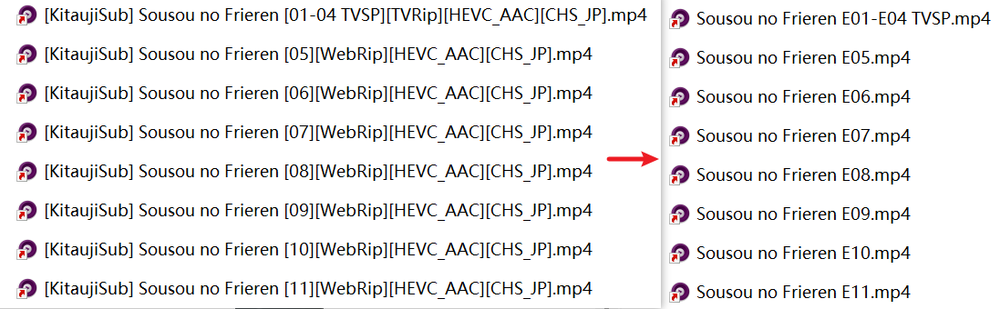
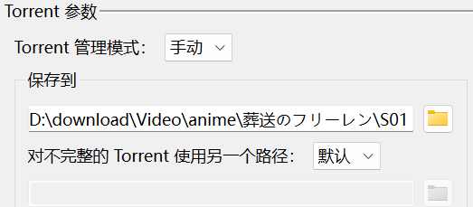

# Aninamer

### An automatic renaming software that works with RSS animation subscriptions and scraping software such as emby.

<a href="READMECN.md">中文README文件

## Function

## How to use

1. Download and unzip latest release to an folder you want(Well,I'll pack it to exe later).

2. Note that you **must ensure that the directory does not contain** `[`,`]`,`<`, `>` ,`-`. Better make sure the programs you subscribe to have a basic classification. It's better to have a name and season number like this.

3. Type the directory you want to detect in the configuration file, such as `D:\download\anime` in the picture above. You can directly edit the files in the conf folder. If the software is running normally, you can right-click the system tray icon to open the configuration file.

4. Run the software. This should now work for most filenames and you can refresh your scraping software to get the metadata for each episode.

5. If you want, you can also add a shortcut to the `startup` folder to let the software run automatically when booting. Put `win`+`R` and type `shell:startup` to open your `startup` folder.

6. If you get bad results, it may be that the original name does not match the program well. You can try to use your wisdom to add special items in the configuration file (the modification will take effect immediately) and change the file back to its original name so that the program can be renamed to solve the problem. Usually this is because the main title is in brackets. The former can be solved by replacing all the characters before the main title with "" in the configuration file. You can right-click the system tray icon to open the configuration file, or directly edit the file in the `conf` folder.  If you want to modify some file manually, make sure that the modified file name does not contain `[`,`]`, and your changes will not be overwritten by the software.

## working for：

 <a href="Task.md">here
