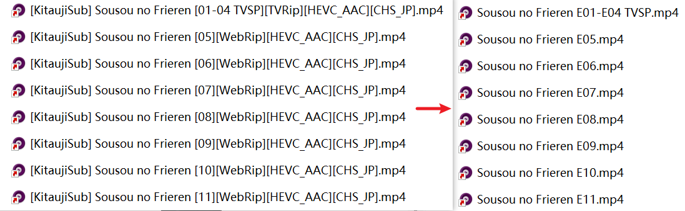
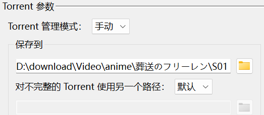

# Aninamer

### 一个自动重命名软件，可以与RSS动画订阅和如emby等刮削软件配合使用。

<a href="README.md">English README file

## 功能

## 如何使用

1. 下载并解压最新版本的Release到你想要的文件夹（好吧，我以后会把它打包成exe）。

2. 注意，你**必须确保目录中不包含**`[`,`]`,`<`, `>` ,`-`。最好确保你订阅的节目有一个基本的分类。最好有一个像这样的名称和季数。

   

3. 在配置文件里输入你要检测的目录，比如上图的 `D:\download\anime`。你可以直接编辑conf文件夹下的文件，打开软件之后，可以右键系统托盘图标来打开配置文件。

4. 运行软件。这样应该就可以适用于大多数文件名，你可以刷新你的刮削软件，获取每一集的元数据。

5. 如果你愿意，你也可以在`startup`文件夹中添加一个快捷方式，让软件在开机时自动运行。按`win`+`R`，输入`shell:startup`，打开`startup`文件夹。

6. 如果重命名没得到预期结果，可能是原来的名字和程序相性不好。你可以尝试动动脑筋在配置文件中添加特殊项(修改后立即生效)并把文件改回原名让程序重新重命名来解决问题。通常这是因为主标题被放在了[]中，需要你在配置文件的Special项里删除掉所有标题前面的字符，表示为把这些字符替换为`''`。如果需要手动修改，确保修改后的文件名不包含`[`,`]`,你的修改就不会被软件覆盖掉了。

## 开发任务

<a href="任务.md">任务列表
